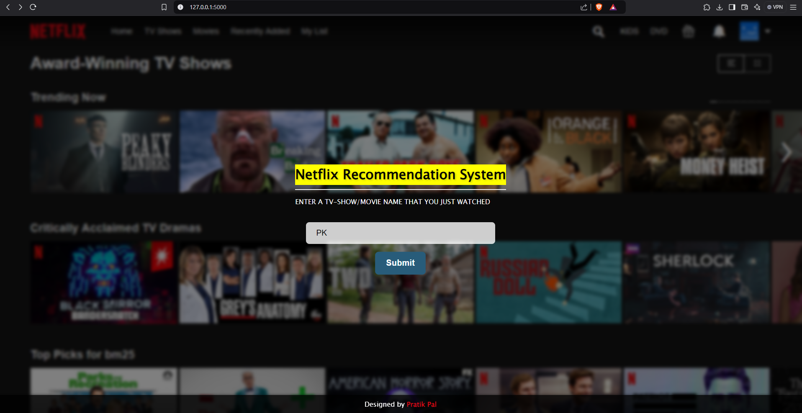
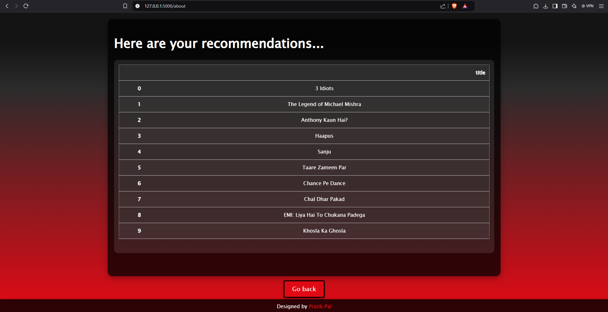

# Netflix Recommendation System

This project implements a **Netflix Recommendation System** that provides personalized movie suggestions based on user preferences and historical data. The system uses machine learning techniques to predict movies or TV shows that a user is most likely to enjoy.
## I've deplpoyed this website: https://pratikkkkkp.pythonanywhere.com/
## Features
- **Movie Recommendations**: Suggests movies based on user ratings and preferences.
- **Collaborative Filtering**: Uses collaborative filtering to recommend movies based on similar users.
- **Content-Based Filtering**: Recommends movies with similar content (e.g., genre, director, etc.) to the ones a user has liked.

## Tech Stack
- **Python**: Core programming language for implementing the recommendation logic.
- **Pandas**: Data manipulation and analysis.
- **NumPy**: Numerical computations.
- **Scikit-learn**: Machine learning algorithms for building the recommendation model.
- **Flask**: (Optional) For deploying the recommendation system as a web app.
- **HTML/CSS/JavaScript**: For the front-end (if applicable for your web interface).

## Screenshot

Here’s a screenshot of the recommendation system interface:

